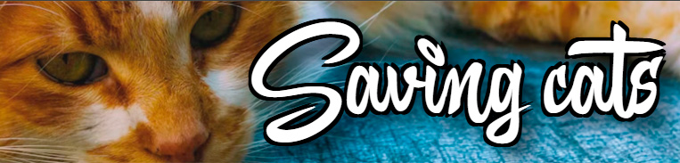

<!-- ÍNDICE -->

  
Índice

  <ol>
    <li>
      <a href="#acerca-del-proyecto">Acerca del proyecto</a>
      <ul>
        <li><a href="#tecnologías">Tecnologías</a></li>
      </ul>
    </li>
    <li><a href="#contacto">Contacto</a></li>
    <li><a href="#agradecimientos">Agradecimientos</a></li>
  </ol>

<!-- ABSOBRE EL PROYECTO -->
## Acerca del proyecto

  

 

  Este protecto es mi "Proyecoto de fin de curso" como estudiante de "Desarrollo de aplicaciones web" en la "Universidad Afonso X - El sabio". Es una aplicación web que permite tanto la visualización de felinos en adopción como la gestión de los mismos. Este proyecto nace desde la gratitud que proceso y he procesado a mis mascotas felinas, las que están y las que ya no están. Viene a ser un una herramienta en proceso de desarrollo para en un futuro no muy lejano ayudar a las asociaciones animalistas a aumentar su tasa de adopciones responsables.

(<a href="#readme-top">back to top</a>)

### Tecnologías

* [![PHP][PHP.com]][PHP-url]
* [![Laravel][Laravel.com]][Laravel-url]
* [![Breeze][Breeze.com]][Breeze-url]
* [![Node.js][Node.com]][Node-url]
* [![JavaScript][JavaScript.com]][JavaScript-url]
* [![SweetAlert2][SweetAlert2.com]][SweetAlert2-url]
* [![HTML5][HTML.com]][HTML-url]
* [![Bootstrap][Bootstrap.com]][Bootstrap-url]
* [![Tailwind][Tailwind.com]][Tailwind-url]
* [![CSS3][CSS.com]][CSS-url]
* [![Vite][Vite.com]][Vite-url]
* [![MySQL][MySQL.com]][MySQL-url]
* [![Eloquent][Eloquent.com]][Eloquent-url]

(<a href="#readme-top">back to top</a>)

<!-- CONTACT -->
## Contacto

Mr. Robert - mrrobert.smartphone@gmail.com

Project Link: [https://github.com/MrRobert1981/savingcats](https://github.com/MrRobert1981/savingcats)

(<a href="#readme-top">back to top</a>)

<!-- AGRADECIMIENTOS -->
## Agradecimientos

Esta plantilla esta basada en el trabajo de: [Othneildrew](https://github.com/othneildrew)

(<a href="#readme-top">back to top</a>)

<!-- ENLACES E IMÁGENES MARKDOWN -->
<!-- https://www.markdownguide.org/basic-syntax/#reference-style-links -->
<!-- [product-screenshot]: resources/images/README.jpg -->
[PHP.com]: https://img.shields.io/badge/PHP-777BB4?style=for-the-badge&logo=php&logoColor=white
[PHP-url]: https://www.php.net/
[Laravel.com]: https://img.shields.io/badge/Laravel-FF2D20?style=for-the-badge&logo=laravel&logoColor=white
[Laravel-url]: https://laravel.com
[Node.com]: https://img.shields.io/badge/Node.js-339933?style=for-the-badge&logo=nodedotjs&logoColor=white
[Node-url]: https://nodejs.org
[JavaScript.com]: https://img.shields.io/badge/JavaScript-F7DF1E?style=for-the-badge&logo=javascript&logoColor=black
[JavaScript-url]: https://developer.mozilla.org/en-US/docs/Web/JavaScript
[SweetAlert2.com]: https://img.shields.io/badge/SweetAlert2-3FC1FF?style=for-the-badge&logo=javascript&logoColor=white
[SweetAlert2-url]: https://sweetalert2.github.io/
[HTML.com]: https://img.shields.io/badge/HTML5-E34F26?style=for-the-badge&logo=html5&logoColor=white
[HTML-url]: https://developer.mozilla.org/en-US/docs/Web/HTML
[Tailwind.com]: https://img.shields.io/badge/Tailwind_CSS-06B6D4?style=for-the-badge&logo=tailwind-css&logoColor=white
[Tailwind-url]: https://tailwindcss.com/
[CSS.com]: https://img.shields.io/badge/CSS3-1572B6?style=for-the-badge&logo=css3&logoColor=white
[CSS-url]: https://developer.mozilla.org/en-US/docs/Web/CSS
[Vite.com]: https://img.shields.io/badge/Vite-646CFF?style=for-the-badge&logo=vite&logoColor=white
[Vite-url]: https://vitejs.dev/
[MySQL.com]: https://img.shields.io/badge/MySQL-4479A1?style=for-the-badge&logo=mysql&logoColor=white
[MySQL-url]: https://www.mysql.com/
[Eloquent.com]: https://img.shields.io/badge/Eloquent-FF2D20?style=for-the-badge&logo=laravel&logoColor=white
[Eloquent-url]: https://laravel.com/docs/eloquent
[Breeze.com]: https://img.shields.io/badge/Breeze-48BB78?style=for-the-badge&logo=laravel&logoColor=white
[Breeze-url]: https://laravel.com/starter-kits#laravel-breeze
[Bootstrap.com]: https://img.shields.io/badge/Bootstrap-7952B3?style=for-the-badge&logo=bootstrap&logoColor=white
[Bootstrap-url]: https://getbootstrap.com/